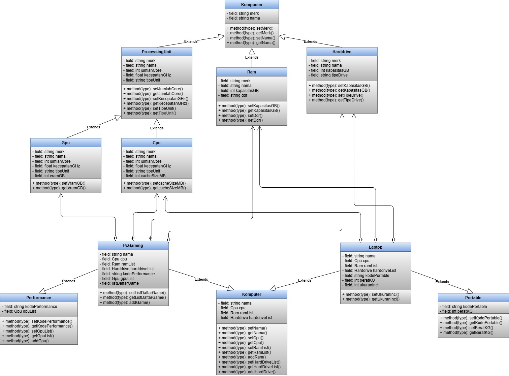
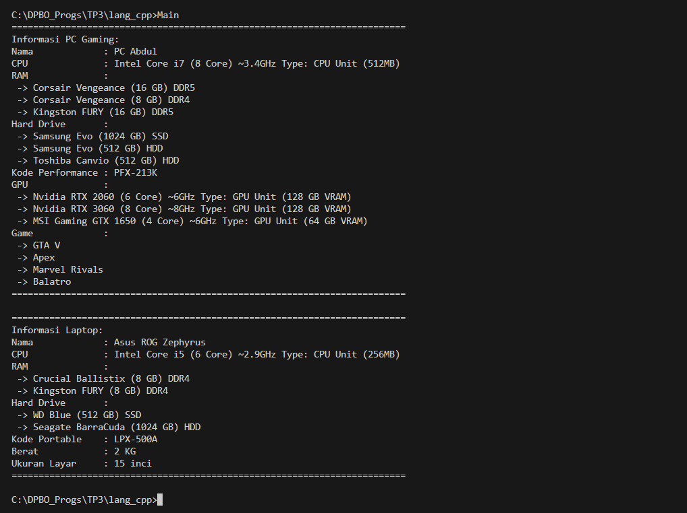

# TP3DPBO2025C2

## Janji 
Saya Abdurrahman Al Ghifari mengerjakan evaluasi Tugas Praktikum dalam mata kuliah 
Desain Pemrograman Berbasis Object untuk keberkahanNya maka saya tidak melakukan kecurangan 
seperti yang telah dispesifikasikan. Aamiin.

## Desain Program
Pada dasarnya, program ini menampilkan konsep Object-Oriented Programming (OOP) dengan beberapa jenis pewarisan (inheritance) dan komposisi. Terdapat sejumlah kelas yang saling berhubungan membentuk hierarki sebagai berikut:

### ProcessingUnit (Parent Class)
- Memiliki atribut dan metode dasar untuk unit pemrosesan (jumlah core, kecepatan GHz, merk, nama, tipe unit).
- Kelas CPU dan GPU merupakan turunan (child class) dari ProcessingUnit (Hierarchical Inheritance).

### Komputer (Base Class)
- Mewakili sebuah komputer secara umum.
- Menyimpan komponen internal seperti CPU, RAM, Harddrive, dan juga dapat menyimpan beberapa GPU.
- Memiliki atribut nama, serta metode untuk menambah atau mengakses komponen (misal addRam(), addHardDrive(), addGpu(), dsb.).
- Kelas PcGaming dan Laptop diturunkan dari Komputer (Hierarchical Inheritance).

### Performance
- Kelas yang berisi atribut dan metode terkait “performansi” (misalnya kodePerformance dan daftar GPU).
- PcGaming mewarisi Performance sekaligus mewarisi Komputer (Multiple Inheritance), karena PC Gaming memerlukan atribut performa khusus dan menampung beberapa GPU.

### Portable
- Kelas yang menyimpan atribut “portabilitas” seperti kodePortable dan beratKG.
- Laptop mewarisi Portable sekaligus mewarisi Komputer (Multiple Inheritance), karena laptop adalah komputer yang portabel.

### PcGaming
- Merupakan child class dari Komputer dan Performance (Multiple Inheritance).
- Memiliki fitur tambahan seperti listDaftarGame dan metode untuk menambah game.

### Laptop
- Merupakan child class dari Komputer dan Portable (Multiple Inheritance).
- Menambahkan atribut ukuranInci sebagai informasi ukuran layar laptop.

### RAM, Harddrive, CPU, GPU
- Kelas-kelas ini berperan sebagai komponen yang akan dikomposisikan di dalam Komputer.
- CPU dan GPU adalah turunan dari ProcessingUnit (Hierarchical Inheritance).
- RAM dan Harddrive berdiri sendiri, tetapi dihubungkan melalui komposisi ke kelas Komputer.

### Dari struktur di atas, kita dapat melihat beberapa pola OOP:
- Hierarchical Inheritance: ProcessingUnit → CPU, ProcessingUnit → GPU, lalu Komputer → PcGaming, Komputer → Laptop.
- Multiple Inheritance: PcGaming (turunan Komputer + Performance), Laptop (turunan Komputer + Portable).
- Composition: Komputer memiliki sekumpulan komponen: CPU, RAM, Harddrive, GPU (disimpan dalam bentuk vector<Ram>, vector<Harddrive>, vector<Gpu>).
- Diagram singkatnya dapat diringkas sebagai berikut:

## Alur Program
1. Inisialisasi Objek
- Program dimulai dengan membuat objek-objek komponen, seperti Cpu, Ram, Harddrive, dan Gpu.
- Kemudian objek-objek ini digunakan untuk membangun sebuah PcGaming (komputer khusus gaming) dan sebuah Laptop.

2. Pembuatan PcGaming
- Objek PcGaming dibuat dengan memasukkan:
    - Sebuah Cpu (misal Intel Core i7).
    - Beberapa Ram (misal Corsair DDR5, DDR4, dsb.).
    - Beberapa Harddrive (SSD, HDD).
    - Kode performance (kodePerformance) yang menandakan seri performa PC gaming.
    - Beberapa Gpu (misal Nvidia RTX 2060, RTX 3060, dsb.).
    - Daftar game awal ({"GTA V", "Apex"}).
- Setelah itu, kita bisa menambahkan lagi komponen seperti RAM, Harddrive, GPU, dan game tambahan dengan metode addRam(), addHardDrive(), addGpu(), addGame().

3. Menampilkan Informasi PcGaming
- Program menampilkan semua informasi PC Gaming: nama, detail CPU, daftar RAM, daftar Harddrive, kode performa, daftar GPU, dan game yang terinstall.

4. Pembuatan Laptop
- Objek Laptop dibuat dengan memasukkan:
    - Sebuah Cpu (misal Intel Core i5).
    - Beberapa Ram (Crucial DDR4, Kingston FURY DDR4, dsb.).
    - Beberapa Harddrive (SSD, HDD).
    - kodePortable (misal "LPX-500A") yang menandakan seri laptop tersebut.
    - Berat laptop (dalam kg) dan ukuran layar (dalam inci).

5. Menampilkan Informasi Laptop
- Program menampilkan semua informasi Laptop: nama, detail CPU, daftar RAM, daftar Harddrive, kode portable, berat, dan ukuran layar.

6. Akhir Program
- Setelah semua informasi berhasil ditampilkan, program berakhir.

## Dokumentasi Program C++

## Dokumentasi Program Java

## Dokumentasi Program Python